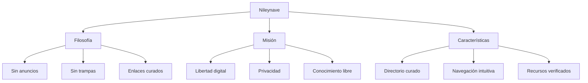
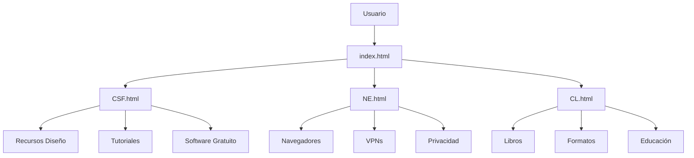
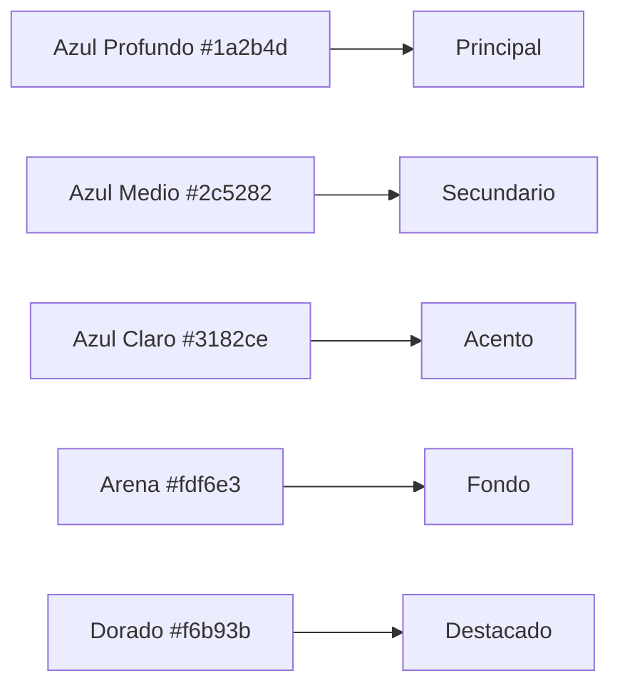
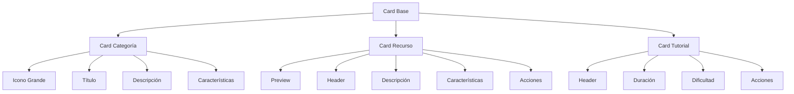
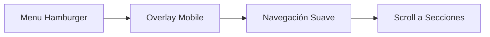
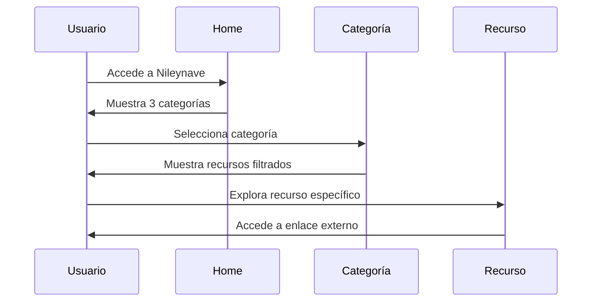
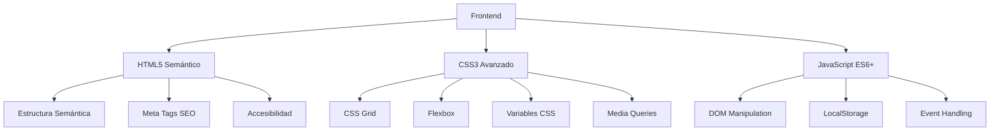
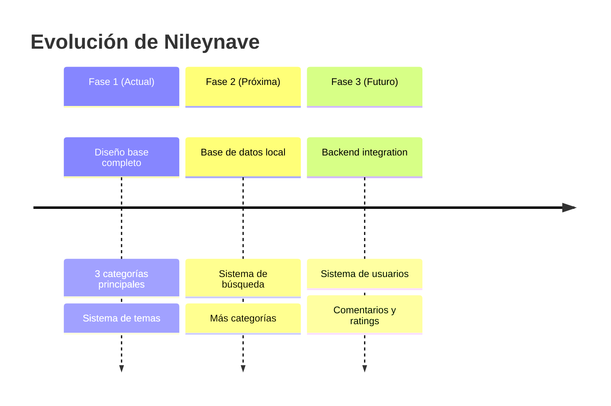

# 🚢 Nileynave - Barco de Libertad Digital


## [🌐 **Visita la Web - Nileynave**](https://jhormancastella.github.io/-Nileynave-/)

## 📋 Índice
- [🎯 Descripción del Proyecto](#-descripción-del-proyecto)
- [🏗️ Arquitectura del Sistema](#️-arquitectura-del-sistema)
- [🎨 Diseño y UX](#-diseño-y-ux)
- [📁 Estructura de Archivos](#-estructura-de-archivos)
- [⚡ Funcionalidades Principales](#-funcionalidades-principales)
- [🎮 Guía de Navegación](#-guía-de-navegación)
- [🔧 Tecnologías Utilizadas](#-tecnologías-utilizadas)
- [🚀 Instalación y Despliegue](#-instalación-y-despliegue)
- [📱 Responsive Design](#-responsive-design)
- [🎯 Características Destacadas](#-características-destacadas)
- [🔮 Futuras Mejoras](#-futuras-mejoras)

---

## 🎯 Descripción del Proyecto



**Nileynave** es un directorio web curado manualmente que ofrece recursos digitales organizados en tres categorías principales:

> 🌊 *"Tu barco de libertad en el mar digital - Sin anuncios, sin trampas, solo enlaces que valen la pena"*

---

## 🏗️ Arquitectura del Sistema

### Diagrama de Estructura
```
nileynave/
├── 📄 index.html              # Página principal
├── 🎨 CSF.html                # Creatividad Sin Fronteras
├── 🔍 NE.html                 # Navegación Esencial  
├── 📚 CL.html                 # Conocimiento Libre
├── 🎨 style.css               # Estilos base
├── ⚡ main.js                 # JavaScript común
└── 📁 assets/                 # Recursos multimedia
```

### Flujo de Navegación


---

## 🎨 Diseño y UX

### Sistema de Diseño Visual

#### Paleta de Colores


#### Sistema de Modo Claro/Oscuro
```css
:root {
  /* Modo Claro */
  --azul-profundo: #1a2b4d;
  --fondo-primario: linear-gradient(135deg, #f0f4ff 0%, #e6eeff 100%);
}

[data-tema="oscuro"] {
  /* Modo Oscuro */
  --azul-profundo: #ebf8ff;
  --fondo-primario: linear-gradient(135deg, #1a202c 0%, #2d3748 100%);
}
```

### Componentes de Interfaz

#### Navbar Responsive
```
🖥️ Desktop: Logo + Título + Menú + Toggle Tema
📱 Mobile: Logo + Hamburger Menu + Toggle Tema
```

#### Sistema de Tarjetas


---

## 📁 Estructura de Archivos Detallada

### 1. `index.html` - Página Principal
```
🏠 INICIO
├── 🎯 Hero Section
│   ├── Tagline principal
│   └── Subtítulo descriptivo
├── 🏝️ Categorías Principales
│   ├── 🎨 Creatividad Sin Fronteras
│   ├── 🔍 Navegación Esencial  
│   └── 📚 Conocimiento Libre
└── 👥 Conócenos
    └── Filosofía del proyecto
```

### 2. `CSF.html` - Creatividad Sin Fronteras
```
🎨 CREATIVIDAD
├── 🗂️ Categorías de Recursos
│   ├── Diseño Gráfico
│   ├── Fotografía
│   └── Video & Animación
├── 💾 Recursos Creativos
│   ├── GIMP - Editor imágenes
│   ├── Krita - Pintura digital
│   ├── Darktable - Fotografía
│   └── DaVinci Resolve - Video
└── 🎓 Tutoriales
    ├── Introducción a GIMP
    ├── Fotografía Digital
    └── Edición con DaVinci
```

### 3. `NE.html` - Navegación Esencial
```
🔍 NAVEGACIÓN
├── 🎛️ Sistema de Filtros
│   ├── Por categoría
│   ├── Por nivel de privacidad
│   └── Por precio
├── 🛠️ Herramientas
│   ├── Firefox Focus
│   ├── DuckDuckGo
│   ├── ProtonVPN
│   └── uBlock Origin
└── 💡 Consejos de Privacidad
    ├── Navegación segura
    └── Protección de datos
```

### 4. `CL.html` - Conocimiento Libre
```
📚 CONOCIMIENTO
├── 📊 Estadísticas
│   ├── 1,247 libros
│   ├── 56 categorías
│   └── 5 formatos
├── 🔖 Filtros Rápidos
│   ├── Ficción, Ciencia
│   ├── Tecnología, Filosofía
│   └── Historia
└── 📖 Biblioteca Digital
    ├── Literatura Universal
    └── Ciencia y Tecnología
```

---

## ⚡ Funcionalidades Principales

### 1. 🎭 Sistema de Temas (Claro/Oscuro)
```javascript
// Almacenamiento en localStorage
localStorage.setItem('tema', nuevoTema);

// Detección de preferencia del sistema
const mediaQuery = window.matchMedia('(prefers-color-scheme: dark)');
```

### 2. 📱 Navegación Responsive


### 3. 🎯 Sistema de Filtros
```javascript
// Filtrado en tiempo real
function filtrarHerramientas() {
  herramientas.forEach(herramienta => {
    const cumpleCategoria = categoria === 'todas' || herramienta.dataset.categoria === categoria;
    // Aplicar filtros...
  });
}
```

### 4. 🎬 Modal de Tutoriales
```javascript
// Sistema de modales con videos
const tutoriales = {
  gimp: {
    titulo: "Introducción a GIMP",
    descripcion: "Curso completo...",
    videos: [...]
  }
};
```

---

## 🎮 Guía de Navegación

### Flujo de Usuario Típico


### Navegación por Teclado
```
Tab ↦ Navegar entre elementos
Enter ↦ Activar enlaces/botones
Space ↦ Alternar temas
Esc ↦ Cerrar modales/menús
```

---

## 🔧 Tecnologías Utilizadas

### Stack Tecnológico


### Características Técnicas
- ✅ **100% Frontend** - Sin dependencias de backend
- ✅ **Progressive Web App** - Funciona offline
- ✅ **SEO Optimizado** - Meta tags y estructura semántica
- ✅ **Accesibilidad** - ARIA labels y navegación por teclado
- ✅ **Performance** - Carga optimizada y lazy loading

---

## 🚀 Instalación y Despliegue

### Despliegue Local
```bash
# 1. Clonar o descargar archivos
git clone [repository-url]

# 2. Estructura requerida
nileynave/
├── index.html
├── CSF.html
├── NE.html
├── CL.html
├── style.css
└── main.js

# 3. Servir con servidor local
# Usar Live Server en VSCode o:
python -m http.server 8000
```

### Despliegue en GitHub Pages
```bash
# 1. Crear repositorio en GitHub
# 2. Subir todos los archivos
# 3. Activar GitHub Pages en settings
# 4. Acceder via: https://[username].github.io/[repository-name]/
```

---

## 📱 Responsive Design

### Breakpoints Utilizados
```css
/* Desktop First Approach */
@media (max-width: 1024px) { /* Tablets */ }
@media (max-width: 768px)  { /* Mobile L */ }
@media (max-width: 480px)  { /* Mobile S */ }
```

### Grid System Adaptativo
```
Desktop (1024px+): 3-4 columnas
Tablet (768px): 2 columnas  
Mobile (480px): 1 columna
```

---

## 🎯 Características Destacadas

### 1. ✨ Experiencia de Usuario
- 🎭 Transiciones suaves y animaciones
- 🌙 Modo oscuro/claro persistente
- 📱 Diseño mobile-first
- ♿ Navegación accesible

### 2. 🔧 Funcionalidades Técnicas
- 💾 Almacenamiento local de preferencias
- 🎯 Scroll suave entre secciones
- 🔍 Filtrado en tiempo real
- 🎬 Sistema de modales avanzado

### 3. 🎨 Diseño Visual
- 🎨 Paleta de colores consistente
- 📐 Espaciado sistemático
- 🔤 Tipografía legible
- 🖼️ Iconografía expresiva

---

## 🔮 Futuras Mejoras

### Roadmap de Desarrollo


### Características Planeadas
- [ ] 🔍 **Motor de búsqueda** interno
- [ ] ⭐ **Sistema de favoritos** 
- [ ] 💬 **Comentarios y valoraciones**
- [ ] 📧 **Newsletter** de nuevos recursos
- [ ] 🌐 **Sugerencia de enlaces** por usuarios
- [ ] 📊 **Analytics** de uso de recursos
- [ ] 🔔 **Notificaciones** de nuevos contenidos

---

## 🌟 Conclusión

**Nileynave** representa una alternativa fresca y ética en el panorama digital actual, priorizando la calidad sobre la cantidad y la experiencia del usuario sobre los ingresos por publicidad. 

> 🚀 *"Un barco sin ley, para navegantes libres"*

---

**📞 Contacto y Contribuciones**
¿Tienes sugerencias o quieres contribuir? ¡El conocimiento es mejor cuando se comparte!

---
*Desarrollado con 💙 para la comunidad digital*
